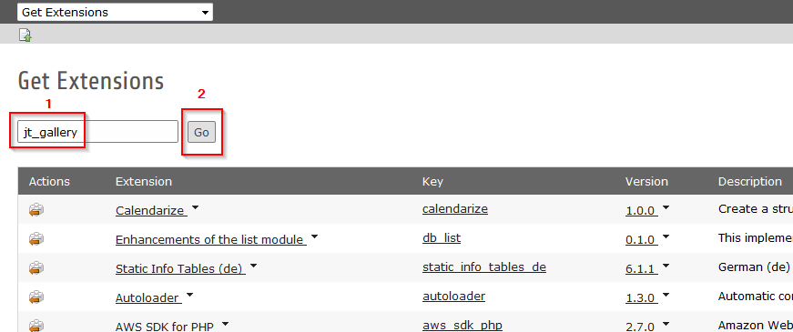

.. ==================================================
.. FOR YOUR INFORMATION
.. --------------------------------------------------
.. -*- coding: utf-8 -*- with BOM.

.. include:: ../Includes.txt

.. _configuration:

Configuration
==============

.. _installation:

Installation
----------------

You can install the extension through the Extension Manager by uploading the .t3x file or by typing the extension key in the search input

   JT Gallery : upload extension

   This is how to install JT Gallery by uploading .t3x file

   JT Gallery : get extension

   This is how to install JT Gallery by getting extension

.. _include-static:

Include static
---------------

After installation, the configuration of the extension must be included

   JT Gallery : include static

   This is the include static of the extension

.. _constant-editor:

Constant Editor
---------------

Two javascript files are included in the constant editor "html5gallery.js" and "jquery.js". The "jquery.js" file must be disabled if jQuery is already included in your website (The minimum required version of jQuery is 1.6)

   JT Gallery : constant editor

   This is the constant editor of the extension with "jquery.js" disabled because already included by te template package of the website
