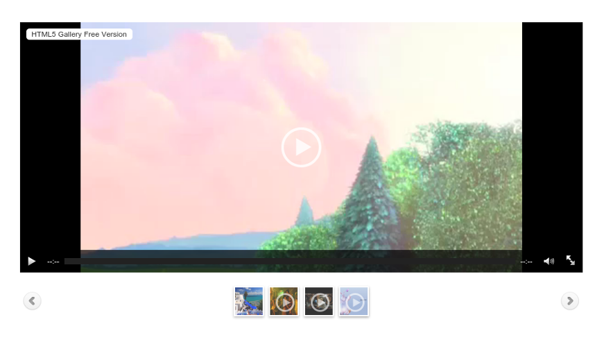
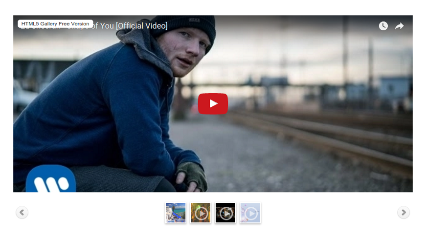
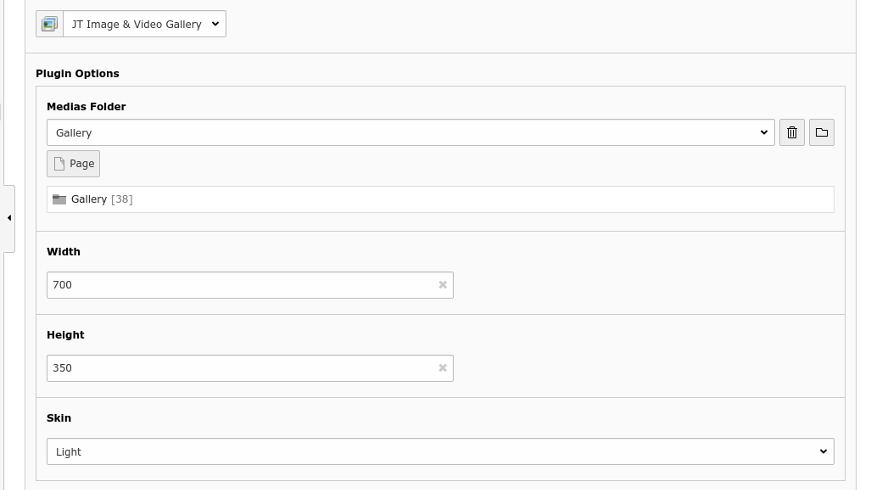

.. ==================================================
.. FOR YOUR INFORMATION
.. --------------------------------------------------
.. -*- coding: utf-8 -*- with BOM.

.. include:: ../Includes.txt

.. _introduction:

Introduction
============

.. _what-it-does:

What does it do?
----------------

jQuery Image and Video Gallery extension. Supports Images, Flash, YouTube, MP4, M4V, OGG, OGV and WebM Videos. Fully responsive and supports desktop, iPhone, iPad, Android and all modern web browsers.

.. _screenshots:

Screenshots
-----------

Here are some shots of JT Gallery in action :

   JT Gallery : video

   This is the video rendering of JT Gallery

.. figure:: ../Images/Introduction/jt_gallery_image.png
   :width: 871px
   :alt: JT Gallery : image

   JT Gallery : image

   This is the image rendering of JT Gallery

   JT Gallery : youtube

   This is the youtube rendering of JT Gallery

   JT Gallery : backend settings

   This is the backend settings of JT Gallery
